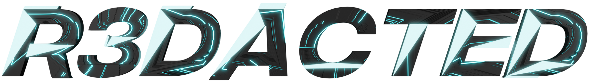

# R3DACTED v1.0


[Team CodeTech](https://teamcodetech.in), Birla Vidya Niketan presents to you <b>"R3DACTED-KNOW NO BOUNDS"</b>, an online cryptic hunt which was held from 00:00 22nd August powered by Servosys Solutions, Repl.it, Gen.xyz, Taskade and Slingshot. If you like challenges and are awaiting for a big one, we are here for you, head over to https://redacted.co.in/ to register yourself for 48hours of brain boggling questions. The leaderboard is frozen however you can still play the hunt. To view hints/solutions join https://teamcodetech.in/#community

## Installation

In case you want to run a development server on your local machine, then follow the following steps. You'll require a MongoDB Atlas cluster to set it up locally.

### Get the repository

Clone the repository

```
git clone https://github.com/BVNCodeTech/R3DACTED.git

cd R3DACTED
```

### Installing Virtual Environment

Be sure to have python >=3.6 installed in your machine and added to `$PATH` for *nix and to `environment variables` in Windows. Next create a virtual environment by installing and using `virtualenv`

```
pip install virtualenv
```

And then create a virtual environment

```
virtualenv subhogay
```

Finally, activate the env

```
source subhogay/bin/activate #For mac os and linux

subhogay\Scripts\activate #For Windows; use backslash
```

### Installing Requirements

Use pip to install all the modules and libraries required for medSCHED in the required.txt

```
pip install -r requirements.txt
```

### Run Flask Server

Before running make sure that port 5000 is free or you can use any other port by passing the `port number` in the run function. You can start the development server like so

```
python3 main.py # For nix

python main.py # For Windows
```

## Developers
|||||
|---|---|---|---|
|[Pancham Agarwal](https://github.com/pancham1603)|[Aryan Sharma](https://github.com/im-NL/)|[Ashish Arora](https://github.com/ashish4arora)|[Suyash Singh](https://github.com/suyash-singh14)

R3DACTED Logo by Shobhit Pandey
